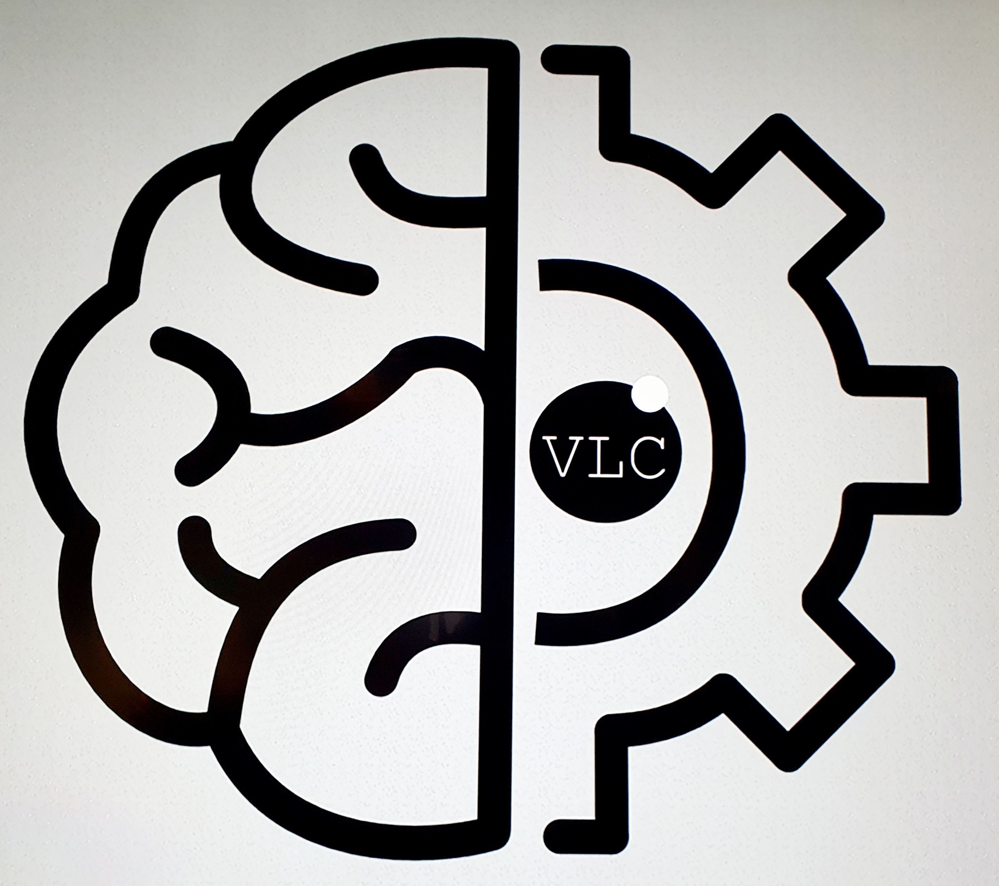
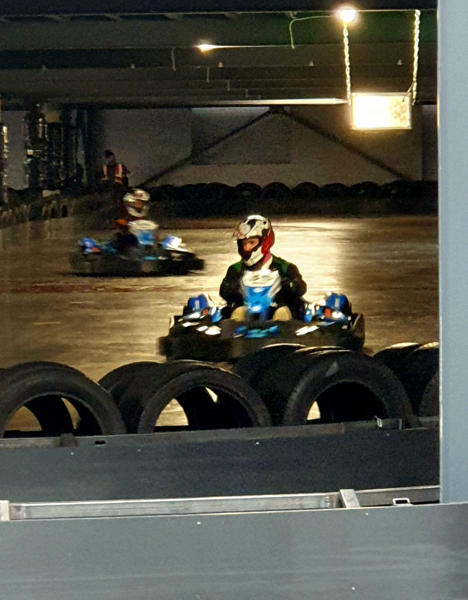
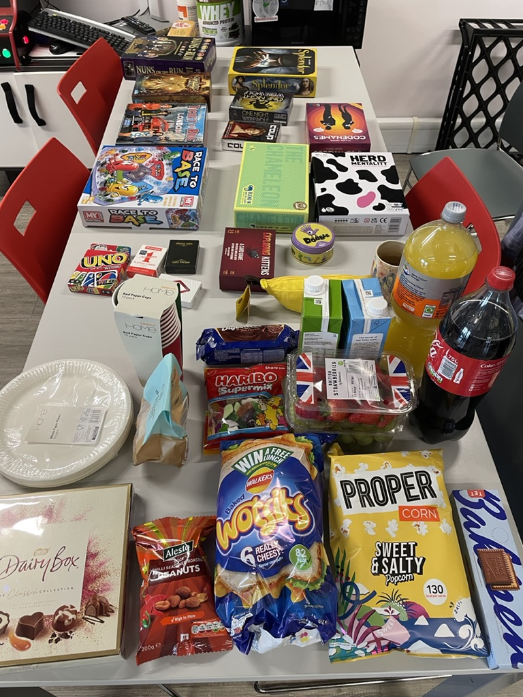
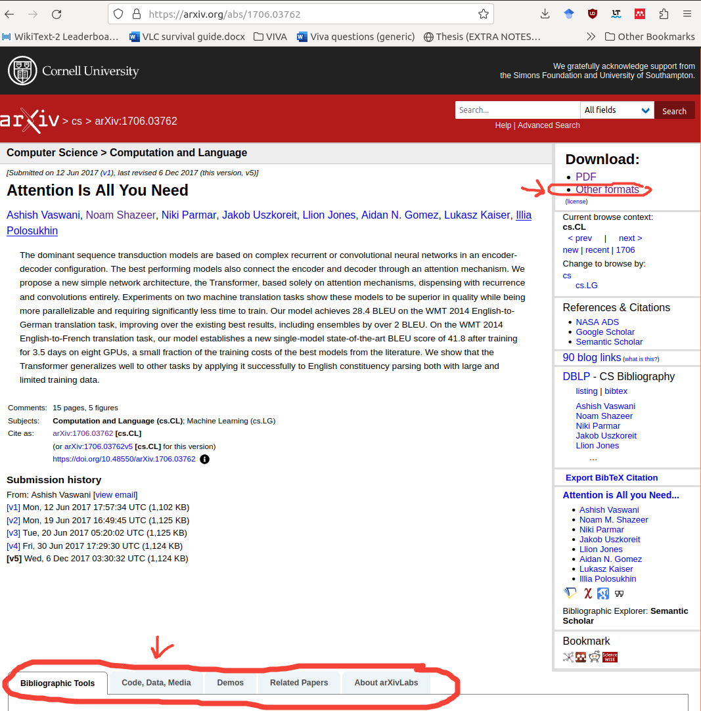
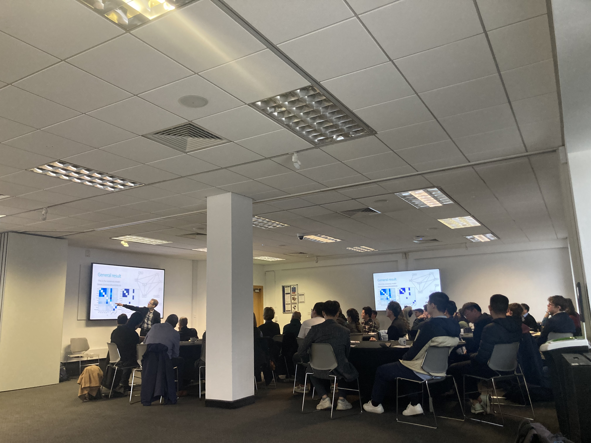

# 
VLC Survival Guide
 
## 
Welcome to your very own helper to get started at VLC :fire:!

### All you need to know about how to get started with the PhD and useful tips about being a VLC member :partying_face:

--- 

### _We want to keep this document as accurate as possible so <ins>please keep it updated</ins>_ :eyes:!  

---

# Contents
- [QUICK LOOKUPS](#quick-lookups)
  - People to Know
  - Connect to our Group Pages!
  - Emergency Numbers  
- [EXTREMELY "IMPORTANT" FACTS](#extremely-important-facts)
  - Coffee Mornings 
  - Kitchen Knowledge
  - VLC Away Days
  - VLC Group Activities
  - ECS Quiet Room
  - Fire Alarm Tuesdays
- [EQUIPMENT SETUP](#equipment-setup)
  - Ordering a PC
  - Setting up Printing
  - Remote Connection 
- [GETTING STARTED WITH RESEARCH](#getting-started-with-research)
  - Useful sources for Finding Papers
  - VLC github repo
  - Slideslive
  - Paperswithcode
  - Bing AI assistant (GPT4 powered AI) or ChatGPT
  - Paper Writing
  - Printing Posters
  - Events
- [GETTING STARTED WITH THE SERVERS](#getting-started-with-the-servers)
  - Setting up to access the University network
  - How to access the VLC severs and Iridis?
  - Iridis
  - VLC servers 
  - Server tips
- [LIFE AS A PhD STUDENT](#life-as-a-phd-student)
  - What is expected of a PhD
  - Progress Milestones
  - Nominal
  - Demonstrating (earn some money)
  - Using your Funding
    - Travelling for Conferences
- [WISDOM FROM YOUR SENIORS](#wisdom-from-your-seniors)

# (Maybe) Coming Soon
- Being a reviewer: How to review papers?
 
---
# QUICK LOOKUPS
## People to Know :busts_in_silhouette:
_(Note: These may change over time so please keep it updated!)_

**VLC head:** Adam Prügel-Bennett
- `apb@ecs.soton.ac.uk` 
- If you have any concerns regarding supervisors or your study. 

**VLC representative:** Eirini Kateri 
- `E.Kateri@soton.ac.uk` 
- Our research group’s very own student rep, responsible for voicing the opinions of the students.  

**Admin representative:** Barbara Lam 
- `barbara.lam@soton.ac.uk`

**Social representatives ("not by choice"):** Eirini and Harry 
- If you want a certain social event/activity to occur let us know, and we will see what we can do!  

## Connect to our Group Pages! :page_facing_up:
- [ ] [ECS-VLC Microsoft Teams](https://teams.microsoft.com/l/team/19%3a5799297bbbb340c48017c1b2e45674e8%40thread.tacv2/conversations?groupId=b02889f5-018c-4490-87d6-e60d99d5259e&tenantId=4a5378f9-29f4-4d3e-be89-669d03ada9d8)  
- [ ] [VLC Github](https://github.com/ecs-vlc)  
- [ ] [VLC Twitter](https://twitter.com/ecsvlc?lang=en) 
- [ ] VLC Journal Club: the Teams page changes every year, so you’ll want to ask someone for the relevant one to join  

## Emergency Numbers 📞
Found on the back of your Student/Staff ID card. 

---
# EXTREMELY "IMPORTANT" FACTS
## Coffee Mornings (Wednesdays) :coffee: :cookie:
- Every **Wednesday 11am-12pm** our group has an entire hour dedicated to talking about anything and everything
(except for work)!  
- 1 person is chosen to give a talk about anything they want.
  - New members of the group MUST give a talk once they join. This is a rule which goes back generations of VLC members and <u>holds for both students and staff</u>!  
- Snacks are always included each week. 
  - You can (optionally) contribute some money towards buying snacks. Details are given at the end of the Monday morning emails!  

## Kitchen Knowledge :fork_and_knife:
- For boiling hot water go to the other kitchen in the south side of the building (where all the supervisor offices are).  
- Don’t use the kettles in the main kitchen (they’re terrible), just use the ones in the north/south corridors. 
- There’s a general waste bin in the lower cupboard under the coffee machines. 
- If you run out of kitchen supplies let our admin representative know and they’ll order more.  
- There is a dishwasher! 
  - Remember to unload it once used! 
  - If there are no more tablets, just take some from the kitchen in the north corridor. 

## VLC Away Days :plate_with_cutlery: :roller_coaster::bowling:
- Each year we have a few events for the entire group! This usually includes a summer pub/walk event, Christmas meal and 
a group event.
- The group event varies every year but has included: go-karting, escape rooms, bowling, laser tag, ... 
- These away days are all about having a fun time and getting to know each other so definitely come! :grin:

  
  

# VLC Group Activities 
We like to thing of ourselves as a social and active group, so ontop of all the away days we also host a variety of
additional activities! Most these activities come from peoples suggestions! So if you want to try something let us know! 
Some activities include:
- Friday pub sessions - (Every 2 weeks!)
- Games Night

- Bob Ross painting session

- AND MANY, MANY MORE!

## ECS Quiet Room :shushing_face:
- **Location**: Level 4, North corridor, 2nd door on the left.       
- Main intention is for mothers to have a place to take care of their infants, but it can be used by anyone. 
- Containing: comfy (extendable) sofa, fridge, lamp, bluetooth speaker, calming aesthetics.

## Fire Alarm (Tuesdays) :fire_extinguisher: :fire:
The fire alarm goes off _every Tuesday_ for testing purposes (no need to evacuate the building for this one!)

---
# EQUIPMENT SETUP
- [ ] [Order a PC/Laptop](https://www.southampton.ac.uk/isolutions/staff/equipment-and-purchasing.page)
  - You'll need to know your RTSG code 
- [ ] Remotely connecting to your PC from other devices 
  - From Windows to Linux: [Remote desktop](https://www.makeuseof.com/tag/remote-control-linux-windows/?newsletter_popup=1)  
  - Remember to be connected to the [VPN](https://knowledgenow.soton.ac.uk/Articles/KB0011610)!
- [ ] Set up [printing](https://www.southampton.ac.uk/isolutions/students/printing-for-students.page) on your devices 

---
# GETTING STARTED WITH RESEARCH
Some helpful starting points for your research including where to find the research of others, paper writing tips 
and events.

## Useful sources for finding papers
### [ArXiv](https://arxiv.org/) (pronounced 'archive') :card_file_box:
- Great place to find papers. 
- Many researchers will use it to publish their work (both in preprint and also once their paper is published).  
- **Fun fact**: most arxiv papers will also have the latex source files accessible (click the Other formats option), so if 
you wonder how some formula/formatting was done you can find out! 
- Many other tools aswell such as finding related works, Code and Demos.

### [OpenReview](https://openreview.net/) :memo:
- Another great place to find papers.
- An advantage of this site over ArXiv you have access to reviewer comments of accepted (and rejected) papers.
from some leading ML conferences/journals (e.g. ICLR, NeurIPS, TMLR, ...). 
- It also hosts papers from all sorts of conferences (AAAI, CVPR, IEEE, ...). 
- If you have a paper submitted to a conference which uses Openreview it will give you good experience 
with learning about rebutting and defending your work.  

### Other sites :globe_with_meridians:
**TIP:** We get access to a lot of research material for FREE!
If research paper sites ask for an **institutional login**, you'll find the University of Southampton
option under the 'Shibboleth' tab (NOT 'OpenAthens'). You just need to login using your university email and password.
- [Google Scholar](https://scholar.google.com/)
- [Semantic Scholar](https://www.semanticscholar.org/)
- [IEEE Xplore](https://ieeexplore.ieee.org/Xplore/home.jsp)
- [Webcat](https://southampton.on.worldcat.org/discovery) - The University's online library services. 
Get access to books through the university which cannot be (freely) accessed online otherwise
- [British Library](https://explore.bl.uk/primo_library/libweb/action/search.do)

## [VLC github repo](https://github.com/ecs-vlc)  :octocat:
- You will need to request to be added. 
- Contains repos from group collaborations and helpful starter repos maintained by the group including: 
  - iridis-useful-script 
  - PythonTeaching  

## [Slideslive](https://slideslive.com/) :film_projector:
- Access talks from conferences.
- Includes: paper talks, spotlight talks, and workshops.
- Popular with conferences like: NeurIPS, ICLR and ICML.

## [Paperswithcode](https://paperswithcode.com/ ) :man_technologist: 
- Open resources with Machine Learning papers, code, datasets, methods and evaluation tables. 

## Bing AI assistant (GPT4 powered AI) or ChatGPT  :robot:
- Both are free access.
- ChatGPT requires a sign up. 
- Bing requires using a personal Microsoft email (your uni email will not work!). 
- Great way to have a ‘rubber duck’ conversation about your work when you hit a wall.  
- **REMEMBER IT’S NOT PERFECT SO ALWAYS FACT AND TAKE SUGGESTIONS WITH A GRAIN OF SALT!** 

## Paper Writing :writing_hand:
- FEPS librarian: ECS have a dedicated librarian ([Nicki Clarkson](https://library.soton.ac.uk/prf.php?account_id=21651))
to help with our literature reviews.
- Use [Overleaf](https://www.overleaf.com) to write your papers (in latex). 
  - PhD [thesis template](https://www.overleaf.com/latex/templates/southampton-phd-thesis/rwkmxqhzktrx) which is 
maintained [here](https://git.soton.ac.uk/el7g15/uos-latex-template). 
- _DO **NOT** USE WORD!_
- Use the **Google Scholar browser extension** to get references fast, but note sometimes the information is inaccurate.
- Manage papers using tools like: Mendeley, Zotero, etc. 
- When mentioning acknowledgements in your papers don't forget to have a shout-out to your funders.

## Printing Posters :printer:
- The most common way is to use the [Print Centre](https://www.southampton.ac.uk/printcentre/posters/index.page).
  - You can pay using your funding (RTSG code) or credit/debit card.
  - If you need to travel with your poster think about using a _canvas_ printing material. It means you can fold your 
poster and easily pack it into your luggage and not have to carry around a poster tube!
- Level 3 of B32 there's a poster printing machine.
  - Potentially free, if not, you'll need a staff member to print it out for you.

---

## Events 
### VLC Conference (Compulsory) 🗣

- Every year VLC hosts its internal student conference to allow students to practice presenting their research and 
networking. 
- **2nd years** are incharge of organising the conference. 
  - You have the freedom to make it however you want!
    - E.g., last time we had a guest panel talking about the dangers of AI! 
- **1st years** have to present posters.
- **2nd and 3rd years** have to give presentations.
- **4th years** are exempt but can give a presentation/poster if they want to.
- Internal/External guest speakers are invited. 
- Staff also attend (but do not have to present).

### [3 Minute Thesis](https://www.southampton.ac.uk/doctoral-college/research-community/three-minute-thesis-competition.page) (Optional) :film_strip:
- A competition where you present your research via a 3-minute presentation.
  - Great way to learn how to summarise your work concisely to audiences not in your field!
- This is a wordwide competition which starts off in Southampton but can lead to competing nationally.
- Finalists are given cash prizes to support their research. 

### Summer Schools (Optional) :school:
- Keep an eye on your email for summer schools in your relevant field.
- Gives you the chance to spend a week or two at another University and attend workshop/lectures.

---
# GETTING STARTED WITH THE SERVERS
There are two important things to know about - the VLC servers and Iridis. These will be what you'll be running your 
BIG experiments on!

The VLC servers are servers specifically for our research group to access and use. 
They have a higher chance of the resources being free to use compared to Iridis. The different VLC servers are called: 
`athena`, `minerva`, `yoshua` and `geoffry`. 
If connecting to a server using SSH use the following `ssh <name>.ecs.soton.ac.uk`. 

IRIDIS 5 is the university’s supercomputer which is available for all PGR students and staff to use for research. 
- See specs [here](https://sotonac.sharepoint.com/teams/HPCCommunityWiki/SitePages/GPU-Computing.aspx).  
- ECS alpha GPU cluster info.: [ECS Alpha (time-share access to a 48GB RTX8000 GPU on Iridis)](https://sotonproduction.service-now.com/serviceportal?id=kb_article_view&sys_kb_id=2629ec181bdfbc50aa835fc4464bcbe4).

## Setting up to access the University network :mortar_board:
- Connect to the University network from outside the University (e.g. at home) via the [VPN](https://knowledgenow.soton.ac.uk/Articles/KB0011610).

## How to access the VLC severs and Iridis? :technologist:
- To access any server you’ll need to be connected to the VPN (unless you’re accessing it through a computer on the 
network already).
- Install [MobaXterm (Home Edition)](https://mobaxterm.mobatek.net/download.html).  
  - It's a Windows application to let you access Linux servers.  
- `sftp`: access linux servers filesystem through linux OS  
- `ssh`: access linux servers via command line 

## Iridis :file_cabinet:
- [Link](https://sotonac.sharepoint.com/teams/HPCCommunity/Shared%20Documents/Forms/AllItems.aspx?id=%2Fteams%2FHPCCommunity%2FShared%20Documents%2FGeneral%2FIntroduction%20to%20cluster%20computing%20on%20Iridis5%2FIridis5%5Fonline%2Epdf&parent=%2Fteams%2FHPCCommunity%2FShared%20Documents%2FGeneral%2FIntroduction%20to%20cluster%20computing%20on%20Iridis5) to notes used for Iridis training course. 
- An extremely helpful starter repo for iridis: [iridis-useful-script](https://github.com/ecs-vlc/iridis-useful-scripts).
  - This repo is part of the VLC github. We encourage people to add to this repo! 
- Join the [Teams group](https://teams.microsoft.com/l/team/19%3a18c8baa70f8540d78455babffe11ad9c%40thread.tacv2/conversations?groupId=a0a40f99-c620-425f-8c12-a1216cf64cce&tenantId=4a5378f9-29f4-4d3e-be89-669d03ada9d8).
  - This is the place to ask any questions related to Iridis!
  
- `sinteractive` (useful command)
  - Lets you interact with the node on Iridis via command line.
  - Options for the nodes include: `gpu`, `gtx1080`, `ecsstaff`, `ecsstaff,ecsall` , `ecsall`.  
    - You must add `-A ecsstaff` if using the ecs (alpha) nodes 
    - The ecs ones are 2 Nvidia RTX's 
    - The `gpu` is a Tesla v100 16GB 
  - The steps to use it:
    1) In terminal open a `screen` session
    2) Run `sinteractive --gres=gpu:1 -p ecsall -A ecsstaff`
       - `gres` represents the number of gpus 
    3) To run shell script use bash: `bash <script.sh> <script args>`
    4) Type `exit` to exit the session 
  
  
## VLC servers :desktop_computer:

### VLC Servers Breakdown 

| Name     |                  OS and CUDA versions                   |                                                                                                                        Where to store data? |                              GPU Info                               |                               CPU Info                               | Memory (RAM) |
|:---------|:-------------------------------------------------------:|--------------------------------------------------------------------------------------------------------------------------------------------:|:-------------------------------------------------------------------:|:--------------------------------------------------------------------:|:------------:|
| Athena   |         Ubuntu 16.04.7; LTS CUDA version: 11.3          |              `/datasets` (Total 5.9T, Available 1.8T). For ‘fast’ SSD storage use: `/ssd` (Total 1.6T, Available 382G, handles ~900 MiB/s). | **4 GPUs**: 1 TITANX (~12.1GB), 3 GeForce GTX 1080Ti (~11.1GB each) |       16 cores/ 32 threads  Intel(R) Xeon(R) 2.6GHz processors       |    128GB     |
| Minerva  |       Ubuntu 16.04.4 LTS; LTS CUDA version: 11.2        | `/datasets` or `/data` - both are equivalent (Total 5.9T, Available 846G). For ‘fast’ SSD storage use: `/ssd` (Total 1.6T, Available 344G). |            **4 GPUs**: GeForce GTX 1080Ti (~11.1GB each)            |       16 cores/ 32 threads  Intel(R) Xeon(R) 2.6GHz processors       |    128GB     |
| Yoshua   | Red Hat Enterprise Linux Server; LTS CUDA version: 12.1 |                                       `/data` (Total 22G, Available 5.9G). For ‘fast’ SSD storage use: `/ssd` (Total 644G, Available 208G). |           **4 GPUs**: 4 GeForce RTX 2080Ti (~11.1GB each)           | 16 cores/ 32 threads  Intel(R) Xeon(R) Silver 4112 2.6GHz processors |    128GB     |
| Geoffrey | Red Hat Enterprise Linux Server; LTS CUDA version: 12.1 |                                       `/data` (Total 22G, Available 5.3G). For ‘fast’ SSD storage use: `/ssd` (Total 644G, Available 102G). |           **4 GPUs**: 4 GeForce RTX 2080Ti (~11.1GB each)           | 16 cores/ 32 threads  Intel(R) Xeon(R) Silver 4112 2.6GHz processors |    128GB     |

### * Note about _yoshua_ and _geoffery_  

These machines are set up slightly differently; you log in with your iSolutions username/password and it will mount your 
iSolutions home directory; to store things locally, create yourself a directory in /local. There is also ssd space on 
/ssd that you can use. One thing to note is that because of the way the machines are setup running longer jobs is a 
little more painful as your home directory will unmount after a period of time if you don’t do anything - see below for 
instructions:

The problem was with the renewal of Kerberos tickets and we now have a solution running on **Yoshua**.
- In your screen session you need to run something like this:  `krenew -K 60 <your command>&`. 
- This will run krenew as a daemon that renews the kerberos ticket before it expires and runs your command in the 
background. 
- You’ll have a maximum runtime of 7 days however you will get a new ticket if you start a new ssh session or run kinit 
in the meantime. 

### * Note about /ssd 
Use this for temporary dataset storage when IO is a bottleneck. Remove your data from /ssd when you are done so others 
have enough space! 

### * Note: the available storage will change over time. Last taken at _28/04/23_ 

### Commands to find the information for each column in the VLC servers breakdown
|                         OS and CUDA versions                          |                          Where to store data? |                                           GPU Info                                           |                                          CPU Info                                          |                      Memory (RAM)                       |
|:---------------------------------------------------------------------:|----------------------------------------------:|:--------------------------------------------------------------------------------------------:|:------------------------------------------------------------------------------------------:|:-------------------------------------------------------:|
| For OS version: `cat /etc/os-release `; For CUDA version `nvidia-smi` |  For storage info: `df -H <data folder path>` | For GPU names: `nvidia-smi --query-gpu=gpu_name --format=csv`; For storage info `nvidia-smi` | For no. CPUs and threads per core: `lscpu \| grep -E '^Thread\|^Core \|^Socket \|^CPU\(' ` | For model name and processor speed: `cat /proc/cpuinfo` |

## Some helpful commands :keyboard:
- `screen` 
  - A Linux command to let you launch and arrange multiple terminal shells within one single shell. 
  - **Why it’s useful**: It will allow you to start a job and still be able to then close the session without the job stopping.
  - [More details](https://www.tecmint.com/screen-command-examples-to-manage-linux-terminals/#1_Start_Screen_for_the_First_Time)  

- `tmux` 
  - Lets you organise and see multiple terminals on a single window.
  - [Cheatsheet](https://tmuxcheatsheet.com/)

- To monitor GPU usage use ` watch -n 2 nvidia-smi ` 
  - `watch` --> repeatedly display the output 
  - `-n 2` --> refresh the result every 2 seconds 
  - `nvidia-smi` --> display GPU usage when running jobs 
  - [More details](https://medium.com/analytics-vidhya/explained-output-of-nvidia-smi-utility-fc4fbee3b124)

- You can force CUDA to only see particular GPUs using the CUDA_VISIBLE_DEVICES environment variable; for example, 
if you want to run on just the first GPU, then `CUDA_VISIBLE_DEVICES=0 python myprogram.py` will do the trick.  
  - If you have GPU-parallel code, then you can specify multiple GPUs by comma separating IDs: `CUDA_VISIBLE_DEVICES=1,2 
  python myprogram.py `

- To check whether your program is limited by disk IO, run `sudo iotop` to see current disk IO usage. 

---
# Life As A PhD Student
## What is expected of a PhD :monocle_face:
- At the end of the day it's all about learn new things. 
- It's a marathon not a sprint, so remember to pace yourself and enjoy your time! 
- Use the first year to try out different things and learn different technologies. 
- Breadth is important too! Sometimes look outside your research area for inspiration. 
- People do change the topic of their PhDs throughout - this can be even in their second or third year!
- There may be times which will be stressful - it's important to remember you're not alone in it all. 
  - The lab is filled with people who may also be or have experienced the same thing and would be happy to hear a 
rant or two! 

## Progress Milestones :triangular_flag_on_post:
[Overview](https://www.southampton.ac.uk/doctoral-college/researcher-resources/handbook/fah/progression.page)
### 9 month (1st progression review)
- **What to submit?** 
  - A short report. 

- **What happens on the viva day?**
  - You give a short 5 min presentation followed by 10-15 mins of questions.

### 18 month (Confirmation/Upgrade)
- **What to submit?** 
  - A report which includes a Gantt chart.
  

- **What happens on the viva day?**
  - You start off with a 10-15 min presentation.
  - Then a talk with 2 members of staff (who are not your supervisors) lasting ~2 hours.
  - Treat this as experience for the real viva; it's probably the most valuable milestone. 
  - Your examiners will be interested in what your future plan is for your work and the next steps!
  

- It may feel like a grilling, but it's done on purpose. You'll get some valuable feedback on how to make your work better! 

### 32 month (Third progression review)
- **What to submit?** 
  - A thesis outline.
    - What each chapter will be and some notes on what each will contain including the contributions.
    - Any remaining work to complete.
    - Good idea to indicate what has/remains to be completed for each chapter.
    

- **What happens on the viva day?**
  - There is no viva for this one!

### Viva
- **What to submit?** 
  - A thesis.
  

- **What happens on the viva day?**
  - You give a short 15-min presentation.
  - You get questions from your examiners.
    - The length of a viva varies for each person. ~2-3 hours is the average.
  - Try to be comfortable on the viva day:
    - You can have a copy of your thesis with you for reference. 
    - You can take in drinks and snacks (e.g. fruits) to keep you going.
    - You can ask for toilet breaks. 
    - You can ask for short breaks. 
    - You can use the whiteboard.

- **Who are my examiners?**
    - Usually there's 1 internal examiner and 1 external examiner. 
    - Internal examiner - someone from your research group.
    - External examiner - someone not affiliated with Southampton Uni.
      - If you have someone in mind you can ask for them!  

- **How to prepare for my viva?** 
  - See [blog post](https://salmapatel.co.uk/academia/phd-viva-preparation-steps/). 
  - [Generic viva questions](https://www.facebook.com/MpwsPostgraduateVivaPresentation/posts/top-40-potential-viva-questions1-can-you-start-by-summarising-your-thesis2-now-c/1073227042855550/).
  - Reread your thesis from start to end - do this a few times! 
    - It can be useful to annotate a printed copy of your thesis!
  - Think of questions that could be asked and keep a list of them along with answers.
  - For the presentation - keep it simple and snappy. Reiterate the main contributions and parts you want to remind 
your examiners of. 
  - Ask people to ask you questions and practice answering them! 

## Nominal - (MAY NEED UPDATING) :hourglass:
- To transfer to nominal fill in this [form](https://sotonac.sharepoint.com/teams/PGRManagerGuide/SitePages/Transfer-to-Nominal-Registration.aspx).
  - Aim to fill in the request to transfer at least 1 month in advance (since it could take time to process). 
  - The form, once filled in, will be sent to your supervisor for approval, and then sent to be signed off by grad school.  
- Once you’ve transferred to nominal **NO tuition fees are payable**.  
- When should I transfer?
  - Usually, you want to take nominal for the “writing up” period of your thesis.
  - In all cases the **<ins>absolute deadline</ins>** for submission of your PhD thesis is at the **end of four years 
of full-time registration**, unless an extension is approved owing to special considerations (e.g., long-term illness, 
Covid-19).
  - Research students who started **<ins>before</ins> 1 August 2020** may transfer to nominal registration for a period 
not exceeding 12 months.  
    - A nominal registration fee (~£120) is payable after 6 months.  
  - Research students who started **<ins>after</ins> 1 August 2020** may transfer to nominal registration for a period 
not exceeding 6 months (or part-time students, up to 12 months).
    - The nominal registration fee is payable when you transfer. 
  - Once in nominal registration, a PhD student is not eligible to apply for a funding extension from the COVID-19 
Phase III scheme. 
  - **You cannot use your funding once you are on nominal!** 

## Demonstrating (earn some money) :man_teacher: 
- Be a demonstrator for undergrad/master lab sessions or a mentor. 
- See [here](https://sotonac.sharepoint.com/teams/UniWorkforcePGRDemonstrator) to get started. 
- Doing this is a good check to make sure you understand the fundamentals. 
- Nice way to earn some extra cash. 
- Be productive while taking mind off your research. 

## Using your Funding :dollar:
If you even need to access your funding you'll need to know your **RTSG code**. 
It should be emailed to you within the first few weeks of starting, but if not you can email our admin rep 
or `fpsepay@soton.ac.uk`.

Unfortunately, there is no easy way to access your RTSG balance. 
You’ll receive an email annually about the balance but if you need to know your balance at any point in time 
you’ll need to email (ECS) finance and ask them for it. 
 

### Travelling for Conferences :luggage:
- See [here](https://sotonac.sharepoint.com/teams/FinancePlanningandAnalytics/SitePages/travel-landing-page.aspx) for info. 

# Wisdom From Your Seniors
Some tips from previous/current students!

- It's a marathon not a sprint! 

- Assume you do not need to do the compulsory research courses unless you really want to! 
  - The best way to get this information is simply by asking around the lab from the students who have experienced 
presenting posters, going to conferences, the different progress milestones. You’ll get more from a 5-minute chat with
a fellow lab member compared to attending a 2-hour lecture session!  
  

- If research paper sites ask for an **institutional login**, you'll find the University of Southampton
option under the 'Shibboleth' tab (NOT 'OpenAthens'). You just need to login using your university email and password.

- Create twitter and reddit accounts and start following relevant people and pages related to AI/ML.
  (YouTube is also a great option).
  - It's a great way to keep up to date with the general topic, popular papers and viewpoints. 
  - In particular for twitter, people will post their new papers with a few bullet points in the comments for their main findings.

